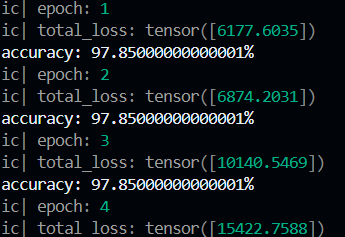

# Research Repository for RC and snnTorch.

# Quickstart

```
pip install -r requirements.txt
cd learn-snntorch
python model.py
```
# 3x3 Case

## Overtraining Avoidance
To avoid overtraining, I will probably use a test set and a train set. If the model performs well on the training set but poorly on the test set I know it's overtrained. The reason my model does tests on the train set is because the train set is all $2^9$ possible $3*3$ matrices.

## Input/Output
The input is a tensor representing the flattened matrix, ex: 
$tensor([1, 0, 0, 1, 1, 0, 1, 0, 1])$

It is then transformed similarly to visualizations/splt.animator.mp4.

The output is a 2D Tensor of confidences, where 
$$ tensor[i] = [confidence_{noline}, confidence_{line}] $$

# Arbitrary Matrix Sizes

## Problem: Test Imbalance
When matrix size is increased, the AI falls for local maxima. This is because the chance of having a line becomes exponentially lower. Formally:

Let $n = numrows, m = numcols$.

Then the probability of a line appearing is
$m * \frac {1} {2^n} + n * \frac {1} {2^m}$.

This causes many adverse effects such as loss increasing, as almost all randomly generated matrices have no lines. The bottom photo shows what happens when test data is randomly generated on a 10x10 matrix: (The model guesses no line `every time`.)



Of course, the model will tune itself until it finally guesses correctly, but this is a terrible strategy, as identifying the less frequent state is almost always better.

Each epoch took a few minutes on my computer with 2GB RAM, where with 3x3's the model was near perfect after a few minutes. 

## Solution

This leads us to the conclusion that testcases must be more balanced (e.g. 50% line, 50% no line)

So a candidate solution is proposed:
Let $diff = count_{noline}-count_{line}$. The we generate $diff$ matrices that we know have a line and add them to the dataset.

This will keep the generation complexity at $O(n)$, and will increase model training speed exponentially.